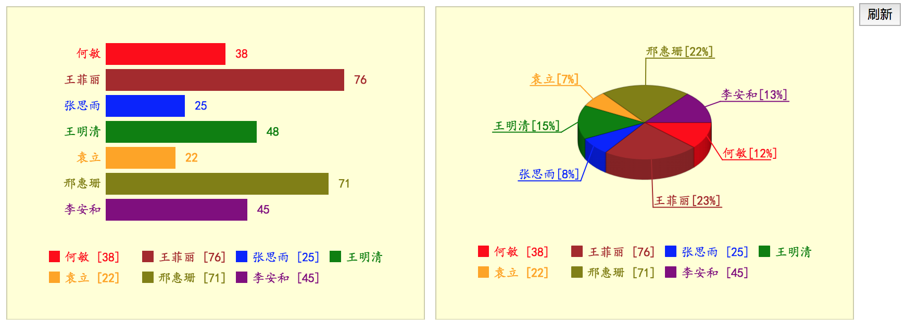

# tigerface.js

感谢你对 tigerface.js 感兴趣。

tigerface.js 的当前版本，正在重构中，代码和文档都在变化中，希望很快会发布稳定正式版本。\[[更新日志](./doc/log.md "更新日志")\]
新版本的网站正在建设，旧版网站：[tigerfacejs.org](http://tigerfacejs.org "tigerfacejs.org")

**tigerface.js 是什么？**

tigerface.js 是一个 javascript 开发架构，用于更简便地实现高度交互性的前端界面，适用开发从动画片头至完整图形设计器的各种场合。包含可独立使用的多个部分，包括：事件、图形、绘制、显示、网络。tigerface.js 用 es6 编写，使用 webpack + babel 编译。

**怎么开始？**

在开始前先理解一些本架构，请[[阅读教程](tutorials/readme.md)]

建议使用 tigerface-cli 工具搭建项目脚手架，先运行范例，看到效果后，再开始写自己的模块。
由于我的环境是 mac，如果你使用 windows 可能略有不同。


1. 安装 tigerface-cli

    tigerface-cli 是一个工具，帮助搭建前端项目的脚手架，并快速运行 tigerface.js 的范例。需要 node.js 8.5 以上版本 

    ```commandline
    npm install -g tigerface-cli
    ```

1. 创建项目目录，然后进入此目录
    ```commandline
    mkdir example
    cd example
    ```

1. 初始化项目结构
    ```commandline
    tigerface init example
    ```

1. 安装依赖, 然后运行。
    ```commandline
    npm install
    npm start
    ```

1. 在浏览器中会显示运行效果：

_说明：此范例是两个图表，点击"**刷新**"按钮_，更新演示数据，重绘图表