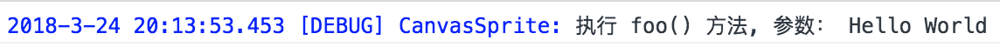
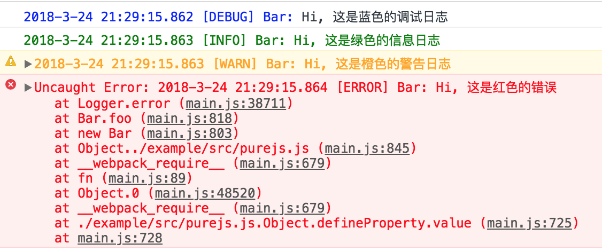
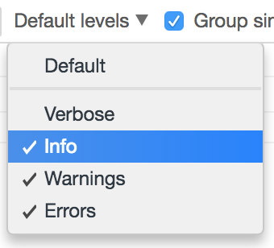
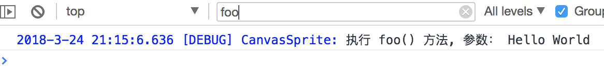

[返回目录](readme.md)

## 日志

tigerface.js 自建了一个日志工具 Logger，用于在开发过程中打印调试信息。
Logger 可同时在浏览器或 node.js 环境下运行。在开发环境下支持 OFF、ERROR、WARN、
INFO、DEBUG 五个级别。在生产环境下，自动全局关闭。

### 开始使用 Logger
* 如果是使用 tigerface-display 包，那么包下的全部类都包含了可直接使用的 Logger 实例。
例如：
    ```javascript
    class Bar extends CanvasSprite {
        // ...
        foo(arg) {
            this.logger.debug('执行 foo() 方法, 参数：', arg);
        }
        // ...
    }
    ```
* 在自己的代码里使用 Logger，首先从 tigerface-common 里加载 Logger，然后初始化。
    ```javascript
    import { Logger } from 'tigerface-common';

    // ...
    
    // 静态初始化
    const logger = Logger.getLogger('');
    ```

输出:



### 日志级别

Logger 有 5 种日志输出级别分别是：

| 级别 | 说明 |
| --- | --- |
| OFF | 关闭 |
| ERROR | 错误 |
| WARN | 警告 |
| INFO | 信息 |
| DEBUG | 调试 |

从上至下日志的输出量增大，每级都包含本级日志及上面各级日志。
日记级别既是日志类型又是输出控制级别。
例如：运行时日志级别设置为`WARN` 日志输出将包含全部的"警告"和"错误"。
如果设置为 `DEBUG` 将输出全部日志。

### 日志输出

Logger 输出直接使用对应的方法名：

```javascript
this.logger.debug('Hi, 这是蓝色的调试日志');
this.logger.info('Hi, 这是绿色的信息日志');
this.logger.warn('Hi, 这是橙色的警告日志');
this.logger.error('Hi, 这是红色的错误');
```
输出效果：



注意：error 方法直接抛出错误异常，运行终止。如果不希望终止运行，需要 `try{...}catch(e){...};`

### 日志的定位

在海量的日志里，寻找有效的信息可用以下几种方法：

* 在浏览器控制台里对输出进行级别过滤：



或者关键字过滤：
    


* 配置 log-config.json 文件

log-config.json 是 Logger 的配置文件，放在项目根目录。编辑此文件，可以更精确的控制日志输出。

```json
{
  "log-level": "warn", 
  "class-log-level": {
    "EventDispatcher":"off",
    "CanvasLayer":"off",
    "DemoDomSprite":"debug"
  }
}
```

`log-level` 是全局日志级别，`class-log-level` 为具体的类指定日志级别，优先级高于全局日志级别。例如：可以关闭全局日志，仅打印指定某类的日志。

```json
{
  "log-level": "off", 
  "class-log-level": {
    "DemoDomSprite":"debug"
  }
}
```


[下一章 事件](event.md)